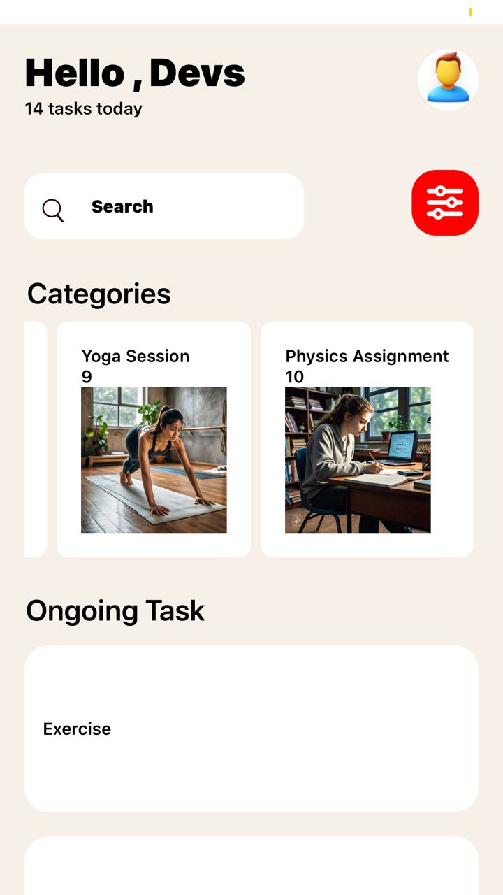
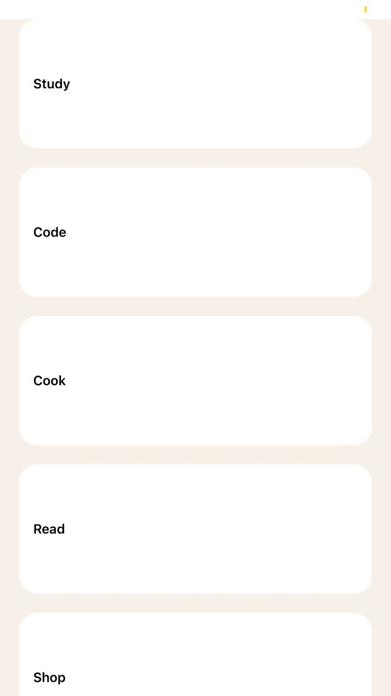
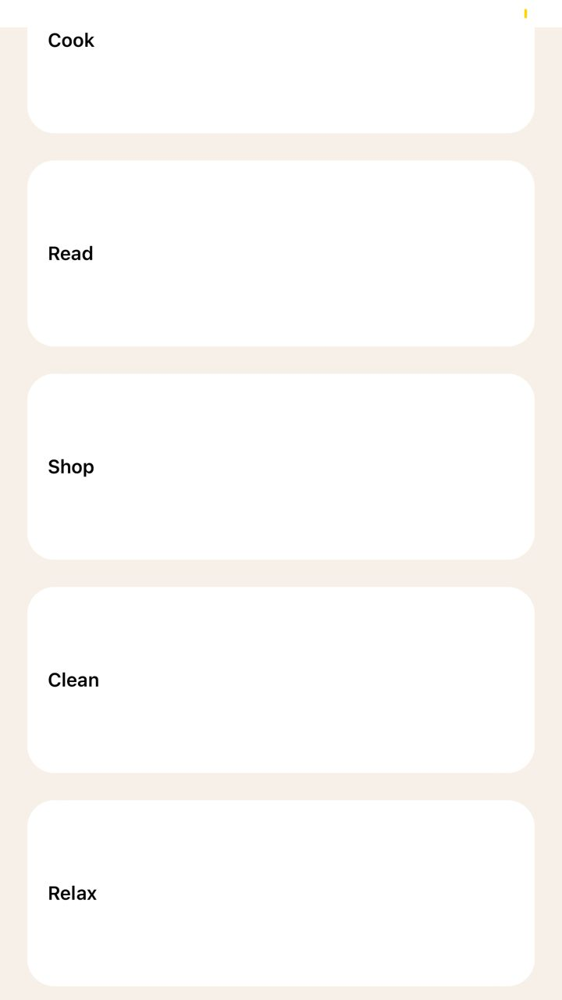

# React Native Expo Task Tracker App

This is a task tracking application built using React Native and Expo. The app allows users to view and manage their daily tasks, categorized into different categories.

## Features

1. **Task List**: The app displays a list of tasks that the user can view and interact with.
2. **Task Categories**: The tasks are organized into different categories.
3. **User Interface**: The app features a clean and intuitive user interface, utilizing various React Native components like `View`, `Text`, `ScrollView`, `TextInput`, `Stylesheet`, `Button`, `FlatList`, `SectionList`, and `Image`.

## Technical Details

The app is structured with the following files:

1. **HomeScreen.jsx**: This is the main screen that renders the categories and tasks.
2. **Category.jsx**: This component represents a single category and its associated tasks.
3. **Header.jsx**: This component displays the app's header.
4. **Task.jsx**: This component represents a single task and its details.

The tasks are stored in an array of strings:

```javascript
[
  "Exercise",
  "Study",
  "Code",
  "Cook",
  "Read",
  "Shop",
  "Clean",
  "Relax"
]
```

The categories are stored in a separate data structure:

```javascript
const data = [
  {
    id: "1",
    number: 1,
    title: "Morning Run",
    imageUrl: task1,
  },
  {
    id: "2",
    number: 2,
    title: "Math Homework",
    imageUrl: task2,
  },
  {
    id: "3",
    number: 3,
    title: "Build React App",
    imageUrl: task3,
  },
  {
    id: "4",
    number: 4,
    title: "Dinner Preparation",
    imageUrl: task4,
  },
  {
    id: "5",
    number: 5,
    title: "Read Novel",
    imageUrl: task5,
  },
  {
    id: "6",
    number: 6,
    title: "Grocery Shopping",
    imageUrl: task6,
  },
  {
    id: "7",
    number: 7,
    title: "Clean Kitchen",
    imageUrl: task7,
  },
  {
    id: "8",
    number: 8,
    title: "Meditation",
    imageUrl: task8,
  },
  {
    id: "9",
    number: 9,
    title: "Yoga Session",
    imageUrl: task9,
  },
  {
    id: "10",
    number: 10,
    title: "Physics Assignment",
    imageUrl: task10,
  },
];
```

The app uses various React Native components to create the user interface, such as `View`, `Text`, `ScrollView`, `TextInput`, `Stylesheet`, `Button`, `FlatList`, `SectionList`, and `Image`.

## Screenshots




